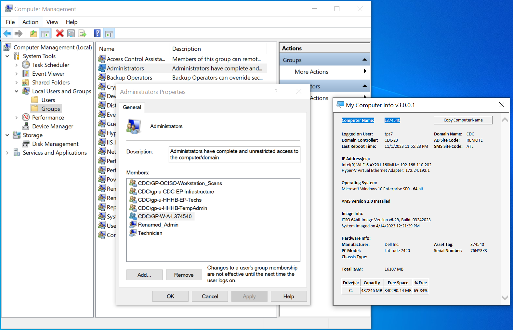

# Prerequisites

1. You must have a superuser (-su) account with administrative rights to your laptop so that Windows Subsystem Linux (WSL) can be installed the first time.

- You can ask for a -su account to be created via [ociotools](https://ociotools.cdc.gov/ep).
- Once it is approved and an -su account has been created in Active Directory under your username (ex. tpz7-su), ensure you can get the `password` of the -su account by logging into [CyberArk](https://cyber.cdc.gov). CyberArk changes the -su account's password every 8 hours. If you can't get into CyberArk, file a ServiceNow [privilege lockout request](https://servicedesk.cdc.gov/sp?id=sc_cat_item&sys_id=32fdbf6e1bd57410a3fb62cae54bcbb1) ticket and/or contact CyberArk team via email: ["CyberArk Ask (CDC)"](mailto:adcybrhelpdesk@cdc.gov)
- Lastly, ensure the -su account is installed on your laptop by doing a search on a Windows computer for `Computer Management`. Navigate to `System Tools > Local Users and Groups > Groups > Administrators` and make sure your computer name (ex. CDC-GP-W-A-L374540) is in this group. You can find your laptop name by searching and running `My Computer Info` and it should show up as the first line called `Computer Name`.

1. You must have access to [github.com/cdcent](https://github.com/cdcent/ocio-wsl/releases) to download the image. Ask for access via [Google Form](https://forms.office.com/Pages/ResponsePage.aspx?id=aQjnnNtg_USr6NJ2cHf8j44WSiOI6uNOvdWse4I-C2NUQjVJVDlKS1c0SlhQSUxLNVBaOEZCNUczVS4u).
